<p align="center">
  
</p>

# Easey by Team Win Win

> **Know your capacity before you say yes.**

Easey is a capacity decision assistant for university students. It reveals the hidden cost of an incoming commitment, lets the student test the consequences before accepting it, and turns overload into a realistic plan, an editable boundary message, and protected recovery.

| Submission item              | Link                                                                                      |
| ---------------------------- | ----------------------------------------------------------------------------------------- |
| **Team**                     | Low Yan Di (2508342), Lim Zhun Zi (2508335), Tee Jun Hao (2508375), Ng Yee Qing (2508347) |
| **Contact Lead**             | Low Yan Di · 011-10893351                                                                 |
| **Problem Statement**        | Stress & Workload Manager                                                                 |
| **Interactive UI Prototype** | [Open Easey](https://loadless-ashy.vercel.app/)                                           |
| **Video Presentation**       | **Add unlisted YouTube link before submission**                                           |
| **Presentation Slides**      | [Easey - Presentation slide](https://canva.link/esg0q5espxtsa28)                                          |

The prototype link has been tested as a public deployment. The current build is an interactive UI prototype using controlled local data and deterministic rules; it does not yet use real accounts, live cross-user data, automatic message access, or a live AI model.

**Quick navigation:** [Project Overview](#1-project-overview) · [Ideation & Process](#2-ideation--process) · [Design & Prototype](#3-design--prototype) · [What Makes It Different](#4-what-makes-it-different) · [Technical Architecture & Feasibility](#5-technical-architecture--feasibility) · [Run Locally](#6-run-the-prototype-locally)

---

## 1. Project Overview

### 1.1 The Problem

Malaysian university students often balance coursework, group assignments, part-time work, clubs, commuting, errands, family responsibilities, and recovery. These commitments are scattered across WhatsApp messages, learning platforms, email, calendars, and memory. A request that sounds small - for example, "Can you prepare the sponsorship deck by Wednesday?" - may hide several hours of focused work, coordination, urgency, context switching, and social pressure.

The failure happens at the decision moment: students frequently say yes before seeing the true cost of the request. By the time a calendar or task manager shows the conflict, the commitment has already been accepted and sleep, recovery, or existing work is at risk.

**Primary stakeholders**

- University students aged approximately 18-25 who manage at least two additional commitment sources alongside their studies.
- Students balancing academic work with clubs, jobs, care responsibilities, commuting, or health needs.

**Secondary stakeholders**

- Assignment teammates and student-society committees coordinating shared work.
- Lecturers, employers, families, and campus support services affected by late overload.

### 1.2 Existing Solutions and the Remaining Gap

The comparison below is based on official product descriptions. It identifies the gap relative to our problem rather than claiming that any product lacks every related feature.

| Existing solution                     | Documented strength                                                                                                  | Gap relative to Easey's target problem                                                                                                        |
| ------------------------------------- | -------------------------------------------------------------------------------------------------------------------- | --------------------------------------------------------------------------------------------------------------------------------------------- |
| [Motion](https://www.usemotion.com/)  | Automatically prioritises and schedules tasks using deadlines, duration, priorities, dependencies, and availability. | Primarily optimises work that is already represented as tasks; our focus is revealing and negotiating an informal request before acceptance.  |
| [Sunsama](https://www.sunsama.com/)   | Combines tasks, calendars, guided daily planning, timeboxing, focus, breaks, and workload awareness.                 | Strong daily planning, but Easey centres the accept / smaller yes / decline decision and connects it to an evidence map and boundary message. |
| [Structured](https://structured.app/) | Combines tasks and to-dos in a visual daily timeline with calendar import and weekly or monthly views.               | Helps users plan their day; Easey additionally models the hidden cost and downstream impact of an incoming commitment.                        |
| [Daylio](https://daylio.net/)         | Supports quick mood and activity tracking with statistics and goals.                                                 | Useful for reflection, while Easey applies current capacity to a specific decision before the next commitment is accepted.                    |
| [Finch](https://finchcare.com/)       | Uses a self-care companion to encourage wellbeing activities.                                                        | Focuses on self-care; Easey links recovery to workload simulation, rebalancing, and boundary communication.                                   |

### 1.3 Our Solution

Easey is a responsive capacity decision assistant built around one complete journey: **Capture -> Simulate -> Rebalance -> Respond -> Recover**. It combines workload information with time, mental effort, urgency, context switching, and optional check-in signals to show a transparent capacity estimate. When a new request arrives, the student can compare a full yes, a smaller yes, or a decline before changing their real plan. Easey then explains feasible adjustments, helps communicate the chosen boundary, and records what was protected.

Easey supports human decisions; it does not diagnose stress, anxiety, depression, or burnout.

### 1.4 Feature Set

| Layer         | Feature                        | What it contributes                                                                                                                                                                                                                                               |
| ------------- | ------------------------------ | ----------------------------------------------------------------------------------------------------------------------------------------------------------------------------------------------------------------------------------------------------------------- |
| Foundation    | Workload Dashboard             | Combines time, mental, physical, social, and errand load into a readable weekly view and highlights overloaded periods and their main drivers.                                                                                                                    |
| Foundation    | Commitment Management          | Adds, edits, completes, and removes commitments with duration, effort, deadline, recurrence, category, flexibility, and dependencies.                                                                                                                             |
| Foundation    | 60-second Check-in             | Lets the student update energy, sleep, stress, and physical fatigue without maintaining a long diary.                                                                                                                                                             |
| Core decision | Hidden Load + Hidden Cost      | Turns a pasted request into editable commitment fields, links them to an Evidence Map, and reveals preparation, travel, coordination, and follow-up work for confirmation.                                                                                        |
| Core decision | Commitment Sandbox             | Simulates the cost of a new request and compares accepting it as requested, offering a smaller yes, moving the deadline, or declining.                                                                                                                            |
| Core decision | Domino Effect                  | Shows where overload squeezes existing work, recovery, and the following days rather than reporting only one final percentage.                                                                                                                                    |
| Core decision | Explainable Rebalancing        | Recommends reducing, moving, or delegating work, explains each trade-off, supports partial improvements, and identifies unresolved conflicts when everything cannot fit.                                                                                          |
| Core decision | My Limits -> Smaller Yes       | Uses the student's available time, acceptable responsibilities, and protected commitments to define a realistic counterproposal.                                                                                                                                  |
| Communication | Boundary + Agreement Follow-up | Drafts an editable boundary message and distinguishes a proposed change from an agreed change. The original responsibility remains until the other person accepts.                                                                                                |
| Outcome       | Decision Receipt               | Records the before/after capacity, ownership, moved work, boundary, agreement state, and protected recovery.                                                                                                                                                      |
| Collaboration | Capacity Circle + Smart Match  | Matches help using opt-in availability, skills, time, and projected capacity; previews the impact on both people and transfers responsibility only after explicit acceptance.                                                                                     |
| Collaboration | Assignment Workboard           | Tracks assignment parts, submissions, comments, and factual contribution evidence without ranking members.                                                                                                                                                        |
| Recovery      | Reset Mode + Recovery Shield   | Flags conflicts with protected recovery and offers a capacity-adaptive Focus Cycle, Tic-Tac-Toe, Tap & Tear, personalised music, breathing, stretching, walking, rest, and connection based on opt-in preferences; optional feedback improves future suggestions. |
| Guidance      | AI Assist prototype            | Clarifies missing information and demonstrates how contextual guidance could lead users into hidden-load analysis, simulation, action, communication, or recovery. Current responses remain controlled prototype content.                                         |

### 1.5 Intended User Impact

Without Easey, Aina sees a simple three-hour request and may accept it immediately. With Easey, she sees that it would raise her weekly capacity from **82% to 113%** and push Wednesday from **94% to 128%**. She can then rescope the deliverable, move flexible errands, delegate research with consent, send a specific boundary message, and reach a more workable **84%** forecast.

The intended change is not merely a lower number. The student makes an earlier, more informed, and more communicable decision.

---

## 2. Ideation & Process

### 2.1 Ideas We Considered

Chosen ideas are listed first. "Deferred" means the idea may be valuable but is deliberately outside the three-week MVP.

| Idea                                                      | Decision and reasoning                                                                                                                                                     |
| --------------------------------------------------------- | -------------------------------------------------------------------------------------------------------------------------------------------------------------------------- |
| **Pre-commitment capacity assistant (chosen)**            | Kept as the core direction because it intervenes before overload and directly fits the Stress & Workload Manager problem.                                                  |
| **Commitment Sandbox (chosen)**                           | Kept as the hero interaction because reviewers can change the scenario and immediately see an explainable consequence.                                                     |
| **Hidden Load Inbox + Evidence Map (chosen)**             | Kept because informal messages are a major source of missed workload. Evidence linking makes extraction reviewable rather than magical.                                    |
| **Explainable Action Plan (chosen)**                      | Kept because a warning alone does not help. It converts overload into specific rescope, move, and delegate options.                                                        |
| **Boundary Assistant (chosen)**                           | Kept because students may understand their limit but still struggle to communicate it without guilt or ambiguity.                                                          |
| **Capacity Circle + Smart Match (chosen)**                | Kept after mentor feedback because it turns capacity into privacy-aware team coordination. Matching considers willingness, skills, time, and projected receiving capacity. |
| **Assignment Workboard and contribution record (chosen)** | Kept to make group-work ownership, progress, submission review, and leader feedback visible without ranking people.                                                        |
| **Capacity-adaptive Focus Cycle (chosen)**                | Kept as a supportive recovery-to-action bridge; the prototype recommends 15/5, 25/5, or 45/10 according to capacity while preserving user control.                         |
| **Tic-Tac-Toe quick reset (chosen after feedback)**       | Kept as a familiar, short, no-score pause after the mentor found the original symbolic activity less useful.                                                               |
| **Tap & Tear sensory reset (chosen)**                     | Kept as a short visual-and-sound release using a clearly fictional assignment page. Its playful tear counter never changes real capacity or rewards repeated tapping.      |
| **Personalised music without a forced timer (chosen)**    | Kept because listening can support recovery or focus without turning relaxation into another deadline.                                                                     |
| SmartSchedule auto-planner                                | Dropped as the main direction. It competes with mature scheduling products and assumes every incoming commitment should be fitted into the week.                           |
| MoodMirror stress tracker                                 | Dropped as the main direction. Tracking is useful but reactive; it detects a state without helping with the next commitment decision.                                      |
| Generic AI wellbeing chatbot                              | Dropped as the main direction. It risks generic advice, hallucination, and weak differentiation. One bounded AI workflow is more feasible.                                 |
| Automatic WhatsApp, email, or LMS reading                 | Deferred because it requires platform access, informed consent, data minimisation, and careful retention rules. Pasting a message is safer for the MVP.                    |
| Automatic delegation                                      | Dropped. Moving overload to another person without permission conflicts with the product's consent principle.                                                              |
| Public team capacity leaderboard                          | Dropped because comparison could shame students or encourage unhealthy competition. Capacity Circle is for coordination, not ranking.                                      |
| Clinical burnout prediction                               | Dropped because the current heuristic is not clinically validated and Easey is a decision-support product.                                                                 |
| Unload backpack activity                                  | Replaced after mentor feedback. Its metaphor communicated load, but the familiar Tic-Tac-Toe reset was easier to understand and demonstrate.                               |
| Gamified streaks and leaderboards                         | Dropped because they could create pressure or addictive use. Recovery activities remain optional and non-competitive.                                                      |
| Stress Sprite Workshop                                    | Deferred as a safety-sensitive future experiment using preset or self-drawn fictional characters, soft symbolic props, capped rewards, and no real-person targeting.       |

### 2.2 Ideation Boards

These are the boards the team used to move from causes and effects, through the wider solution space, into the selected end-to-end concept. They are included as process evidence rather than decorative diagrams.

#### Board A - Problem Tree

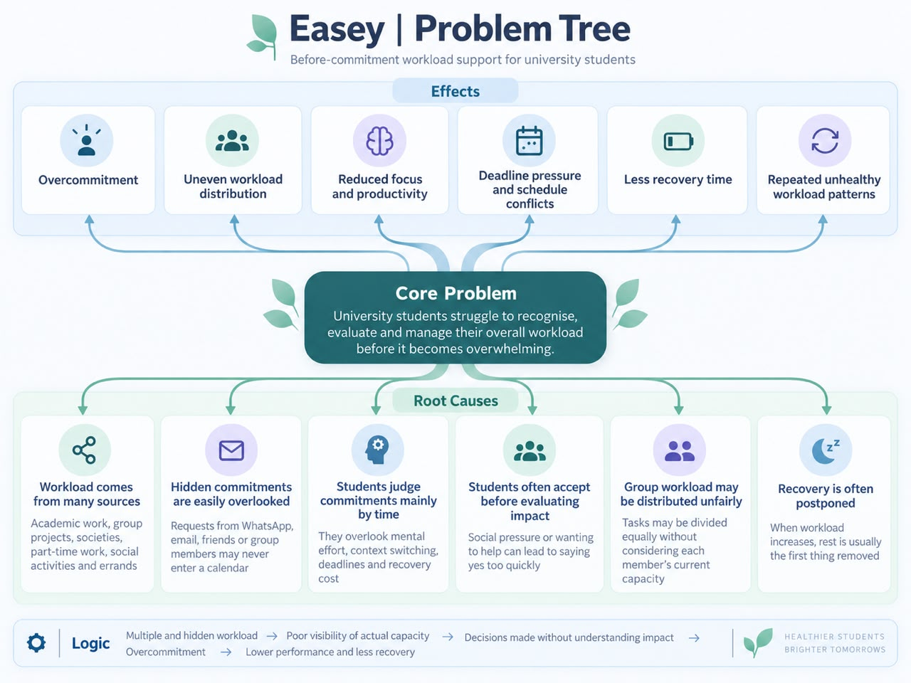

The problem tree connected scattered workload, hidden commitments, time-only judgement, social pressure, unequal group work, and postponed recovery to one central failure: students struggle to evaluate total workload before it becomes overwhelming. This moved us away from building another calendar.

#### Board B - Ideation Mindmap

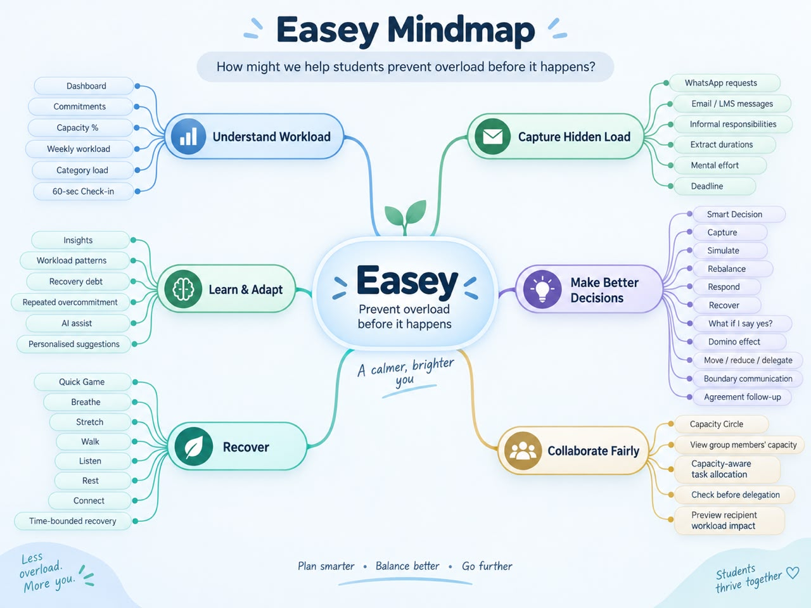

The mindmap explored six directions: understand workload, capture hidden load, make better decisions, collaborate fairly, recover, and learn from patterns. We assessed the branches using relevance, novelty, demonstrability, safety, and three-week feasibility; the pre-commitment decision journey connected the strongest branches.

#### Board C - Core User Flow

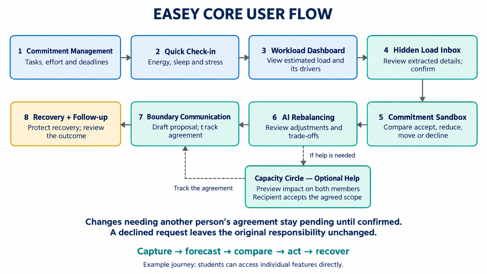

The final flow starts with ordinary commitments and a short check-in, then moves through **Capture -> Forecast -> Compare -> Act -> Recover**. Capacity Circle is an optional help path, and any change involving another person stays pending until they accept it. This turns a broad feature set into one judge-visible outcome.

### 2.3 Mentor Consultation

| Date             | Mentor      | Feedback received                                                                                                                                            | What changed                                                                                                                                                                            |
| ---------------- | ----------- | ------------------------------------------------------------------------------------------------------------------------------------------------------------ | --------------------------------------------------------------------------------------------------------------------------------------------------------------------------------------- |
| 9 September 2026 | Lim Zi Yang | The Unload backpack activity was not important in his view; a familiar game such as Tic-Tac-Toe would be easier to understand.                               | Replaced Unload in the immediate Recovery Menu direction with a short, optional Tic-Tac-Toe reset and kept games secondary to the decision journey.                                     |
| 9 September 2026 | Lim Zi Yang | Capacity Circle was distinctive and feasible if it used invite-only groups, consent-based sharing, and help matching.                                        | Implemented the Capacity Circle UI, privacy toggles, opt-in Smart Match logic, Assignment Workboard, comments, and contribution record. Real accounts and notifications remain planned. |
| 9 September 2026 | Lim Zi Yang | The core prototype was already substantial; remaining effort should prioritise presentation clarity and evidence rather than uncontrolled feature expansion. | Froze the core MVP around Capture -> Simulate -> Rebalance -> Respond -> Recover and improved the report, prototype evidence, safety wording, and demo consistency.                     |

**How the consultation influenced our judgement.** We did not turn Easey into a gaming app. We accepted the useful interaction feedback but kept the Commitment Sandbox as the hero feature. We also elevated Capacity Circle while explicitly designing against privacy exposure, automatic delegation, and capacity ranking.

---

## 3. Design & Prototype

**Public UI prototype:** [https://loadless-ashy.vercel.app/](https://loadless-ashy.vercel.app/)

The public link is the frozen finalist build. It demonstrates the complete Aina scenario with reliable local data and has been checked against this README. The interface is responsive and uses warm colours, status labels, icons, and facial expressions so that capacity is not communicated through colour alone.

### 3.1 Eleven Key Screens

#### 1. Commitments

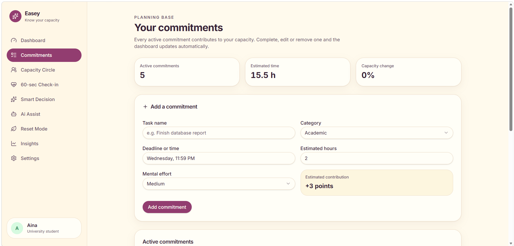

Students can add, edit, complete, or remove tasks with category, deadline, duration, and effort. This ordinary task-management foundation gives the capacity model confirmed workload data.

#### 2. Quick Check-in

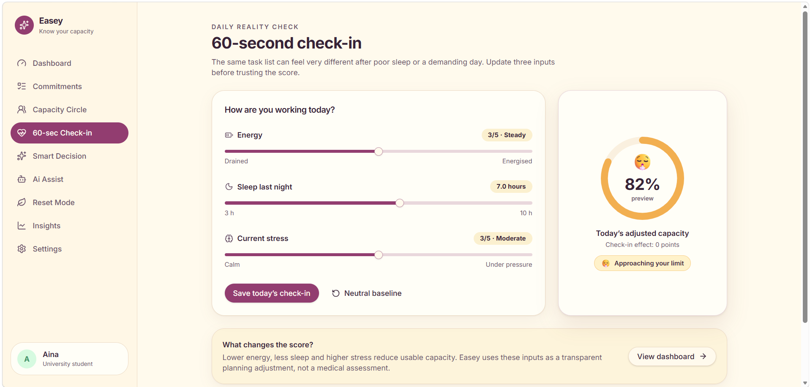

Students enter energy, sleep, and current stress in about 60 seconds. The check-in keeps suggestions responsive to changing capacity without requiring a long mood diary.

#### 3. Capacity Dashboard

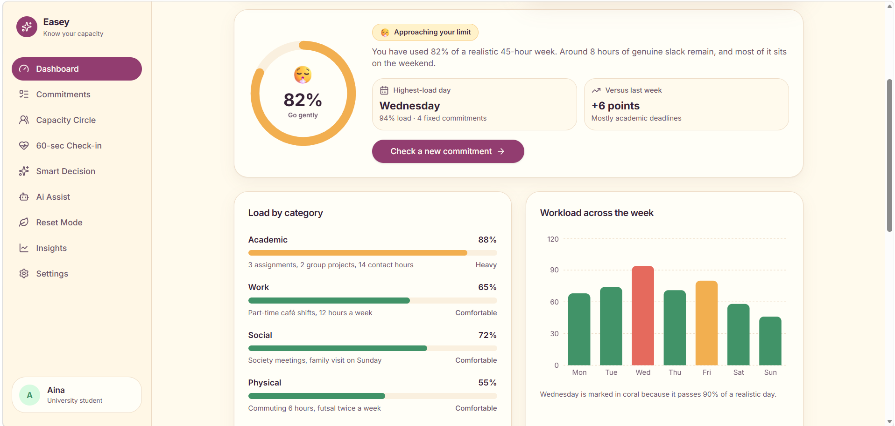

Aina can see her 82% weekly capacity, Wednesday as the highest-load day, category load, workload across the week, and the factors contributing to the score.

#### 4. Hidden Load Inbox

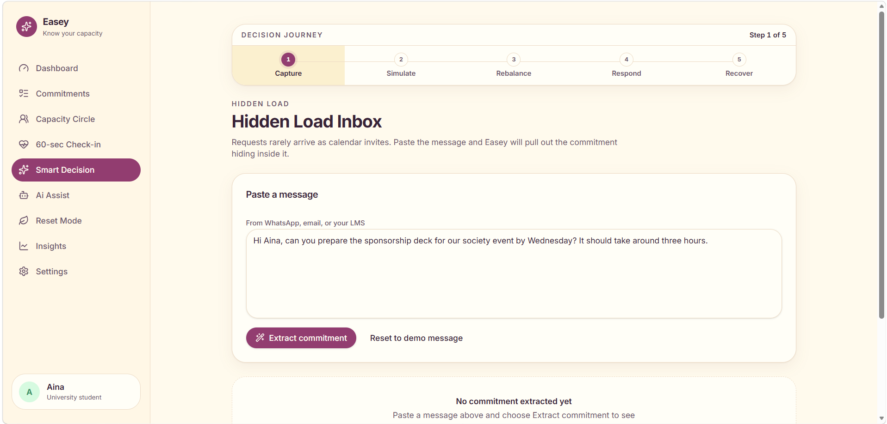

Aina pastes an informal request, reviews the Evidence Map, and confirms editable task details. Nothing enters the plan until she has checked it.

#### 5. Commitment Sandbox

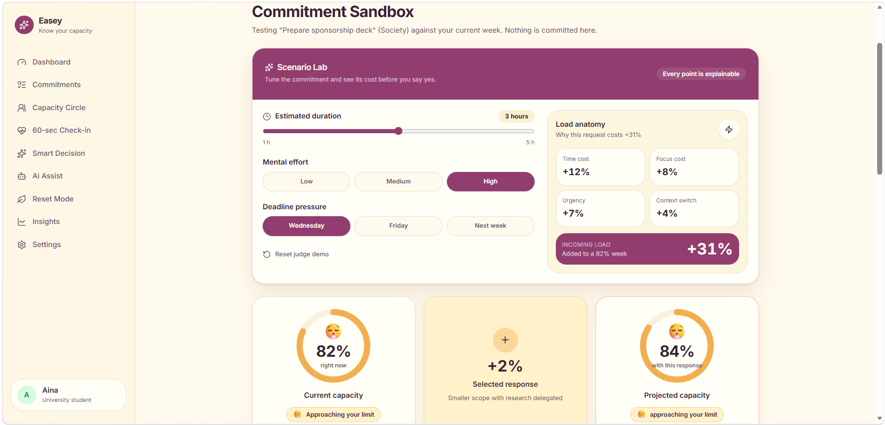

The Sandbox compares capacity before and after accepting, reducing, moving, or declining the request. In the demonstration, the incoming task adds 31 explainable points and changes the forecast from 82% to 113%.

#### 6. Action Engine

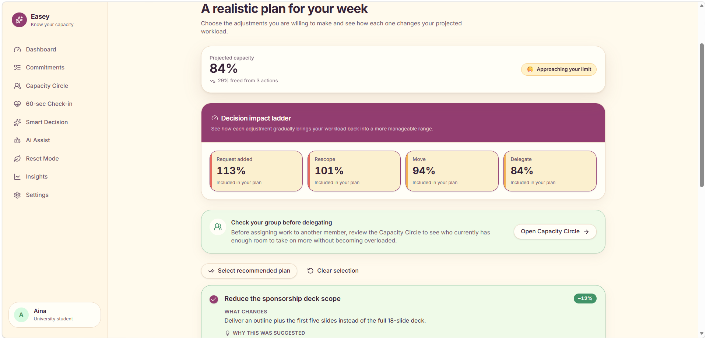

The Action Engine presents three trade-offs with reasons and estimated capacity savings. Its Impact Ladder shows how rescoping, moving, and delegating work reduce 113% to 101%, then 94%, and finally 84%.

#### 7. Boundary Assistant

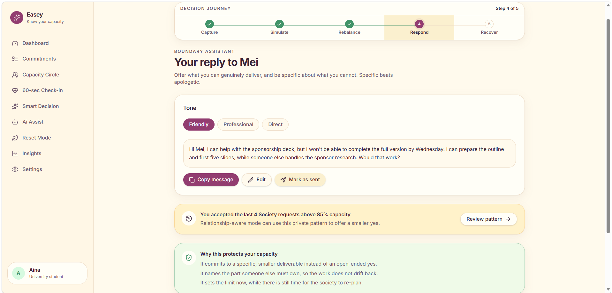

The student edits a polite decline, delegation request, or reduced-scope proposal. Friendly, professional, and direct tones support communication while leaving the final wording and sending decision with the student.

#### 8. Recovery and Follow-up

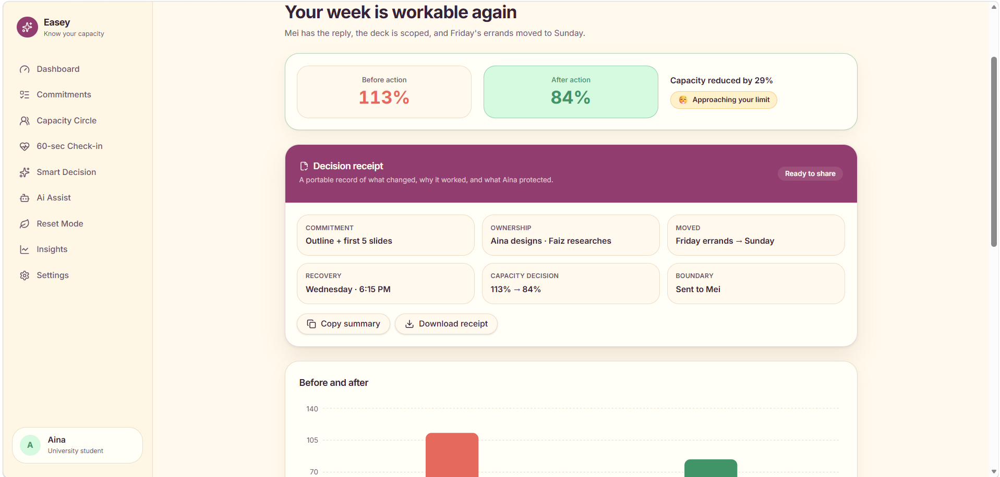

The Decision Receipt records the 113% to 84% outcome, selected actions, ownership, moved work, boundary, and protected recovery. The student can then report whether more recovery is needed.

#### 9. Capacity Circle

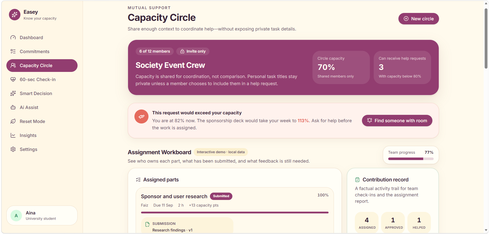

The invite-only Circle previews privacy-aware group capacity and helps a student request support from a member with room. The Assignment Workboard records parts, progress, submissions, leader comments, and factual contribution evidence without ranking members.

#### 10. AI Assist

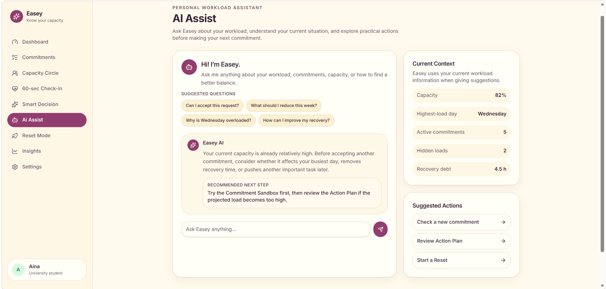

Students describe a workload concern and explore suggestions grounded in current commitments and preferences. AI Assist guides them towards simulation, rebalancing, boundary communication, or recovery, while proposed changes remain subject to confirmation.

#### 11. Reset Mode

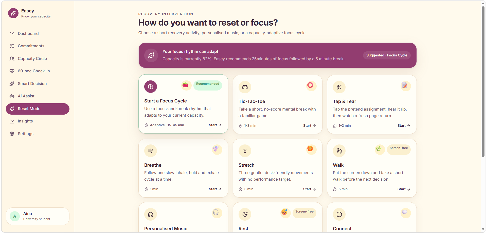

Students explore recovery and focus activities based on preferences collected during onboarding, current workload, available time, and environment. They can choose a different activity, protect recovery through Recovery Shield, and optionally provide feedback afterwards.

**Prototype status:** this is an interactive UI using controlled local demo data. Live AI extraction, real accounts, invitations, notifications, and cross-user synchronisation are not yet connected.

### 3.2 Design Decisions

- **Warm, low-pressure interface:** off-white surfaces, plum accents, soft green confirmations, rounded cards, and supportive language avoid making the dashboard feel clinical.
- **More than colour:** percentages, labels, icons, facial expressions, and written explanations communicate risk accessibly.
- **Progressive disclosure:** students first see the decision, then detailed calculations and downstream effects when needed.
- **Human confirmation:** extracted fields, AI drafts, schedule changes, delegation, and outgoing messages always remain editable and require confirmation.
- **Privacy by default:** personal task names and check-in answers remain private unless the user deliberately shares limited signals.
- **No shame mechanics:** no public rankings, forced streaks, or recovery leaderboards.

### 3.3 Prototype Status and Limitations

| Working in the public prototype                            | Planned for the building phase                                             |
| ---------------------------------------------------------- | -------------------------------------------------------------------------- |
| Responsive navigation and interactive screens              | Real sign-up and login                                                     |
| Commitment CRUD and local persistence                      | Persistent Supabase database                                               |
| 60-second check-in                                         | Cross-device synchronisation                                               |
| Explainable capacity calculation                           | Validated weighting through student testing                                |
| Hidden-load demo extraction and Evidence Map               | One bounded Dify extraction workflow with schema validation                |
| Interactive Scenario Lab and charts                        | Robust AI schema validation and fallback                                   |
| Action selection, Boundary Assistant, and Decision Receipt | Saved per-user decision history                                            |
| Capacity Circle, Workboard, and privacy-control UI         | Real circles, consent records, transactional acceptance, and notifications |
| Reset activities and Focus Cycle                           | Personalised recommendations based on opt-in preferences                   |

---

## 4. What Makes It Different

Easey's novelty is the **decision sequence**, not a claim that every individual component has never appeared elsewhere.

### 4.1 Four Signature Innovations

1. **Pre-commitment simulation**  
   The Hidden Load Inbox turns an informal request into editable fields and links each extracted detail to source evidence. The Commitment Sandbox then lets the student test a full yes, smaller yes, deadline change, or decline before changing the real week.

2. **Explainable decisions rather than a mystery score**  
   Easey separates time, focus, urgency, and context-switch costs, then shows how every selected action changes the forecast. The Action Plan, Boundary Assistant, and Decision Receipt connect insight to a specific negotiation and an auditable outcome.

3. **Privacy-aware Capacity Circle**  
   The twist is not simply sharing a workload percentage. Members control what others may see; Smart Match considers willingness, skills, available time, and projected receiving capacity; and responsibility moves only after both people agree on the scope and the recipient explicitly accepts it.

4. **Capacity-adaptive recovery and focus**  
   Recovery is part of the workload decision rather than a separate wellness tab. Recovery Shield protects rest, while Focus Cycle recommends a gentler or deeper rhythm according to the current capacity indicator and always permits user override.

### 4.2 Supporting Innovation

- **Domino Effect:** reveals where the consequences appear across days, work, and recovery rather than showing only a final percentage.
- **Agreement Follow-up:** a reduced-scope message is a counterproposal, not an automatic change. Until it is accepted, the original responsibility stays in the plan.
- **Assignment Workboard:** combines deliverables, submissions, comments, and factual contribution evidence without turning teamwork into a popularity score.
- **Capacity-adaptive Focus Cycle:** recommends 15/5, 25/5, or 45/10 based on the current capacity state while preserving user override.
- **Tap & Tear:** provides visual, sound, and optional vibration feedback using a pretend assignment; its playful counter is explicitly separate from the real capacity model.

### 4.3 Differentiation Summary

| Need                        | Planning tools (Motion / Sunsama / Structured)                                           | Wellbeing tools (Daylio / Finch)                        | Easey                                                                                |
| --------------------------- | ---------------------------------------------------------------------------------------- | ------------------------------------------------------- | ------------------------------------------------------------------------------------ |
| Before the user says yes    | Usually not the main workflow                                                            | Usually not the main workflow                           | Core workflow: capture and simulate first                                            |
| Transparent cost breakdown  | Time and scheduling are central; social pressure and context cost may remain implicit    | Mood or self-care is central                            | Time, effort, urgency, and context switching are shown separately                    |
| Consent-based team help     | Collaboration may exist, but capacity consent is not normally the central decision layer | Generally individual                                    | Invite-only Circle, visibility controls, impact preview, Smart Match, and acceptance |
| Assignment evidence         | Task status is common                                                                    | Not the main purpose                                    | Workboard, submissions, leader comments, and factual contribution record             |
| Boundary communication      | Not usually tied to a simulated capacity trade-off                                       | Not usually tied to workload ownership                  | Editable response generated from the selected plan and tracked until agreement       |
| Recovery linked to workload | Usually separate from scheduling                                                         | Wellbeing is central but not tied to a request forecast | Decision Receipt, Recovery Shield, reset options, and adaptive Focus Cycle           |

_Desk-research references: Motion, Sunsama, Structured, Daylio, and Finch official product pages. Claims are limited to the high-level functions reviewed during ideation._

### 4.4 Future Engagement Concept - Stress Sprite Workshop

This is a **future validation experiment, not part of the functional MVP**. Students would customise a fictional stress sprite using preset shapes, colours, accessories, or their own drawing. Completing verified work could unlock private cosmetic props and gentle visual effects, creating a symbolic release without targeting a real person.

| Student action                      | Proposed reward                             | Healthy-engagement rule                                  |
| ----------------------------------- | ------------------------------------------- | -------------------------------------------------------- |
| Complete a normal commitment        | Earn 1 star after marking the task complete | No stars for repeated taps or repeated check-ins         |
| Complete a reviewed assignment part | Earn 2 stars after submission or approval   | Verification prevents reward farming                     |
| Spend stars                         | Unlock a private cosmetic prop or effect    | No paid stars and no workload advantage                  |
| Use the reset                       | 60-90 seconds of symbolic interaction       | Session cap, optional reflection, and return-to-plan cue |

The concept has no public leaderboards, paid currency, streak penalties, or rewards for excessive use. It does not require a photograph: the default uses preset cartoon parts or a self-drawn fictional face. Uploading, naming, or recreating another real person as a target would not be allowed. The experiment would proceed only if student testing shows useful short-term relief without increased screen dependence or aggressive behaviour.

---

## 5. Technical Architecture & Feasibility

### 5.1 Current Tech Stack

| Layer                 | Technology                 | Why we chose it                                                                | Current constraint                                                               |
| --------------------- | -------------------------- | ------------------------------------------------------------------------------ | -------------------------------------------------------------------------------- |
| Frontend              | React 19 + TypeScript      | Component reuse and compile-time type checking for a growing interaction flow. | Browser-only code cannot safely hold secret API keys.                            |
| Build tooling         | Vite                       | Fast local development and a simple production build.                          | Requires a separate backend for secure and multi-user operations.                |
| Styling               | Tailwind CSS 4             | Rapidly produces a consistent responsive design system.                        | Utility classes require discipline to keep complex screens maintainable.         |
| Routing               | TanStack Router            | Gives each stage and feature a stable route for demos and testing.             | Shared journey state must be persisted when a real backend is added.             |
| UI components         | shadcn/ui + Radix UI       | Reusable, accessible primitives for dialogs, sliders, switches, and forms.     | Accessibility still requires keyboard and screen-reader testing.                 |
| Visualisation         | Recharts                   | Supports workload charts and before/after comparisons.                         | Charts must always have labels and text alternatives.                            |
| Icons and feedback    | Lucide + emoji status cues | Keeps actions understandable and ensures colour is not the only signal.        | Emoji appearance varies slightly by operating system.                            |
| Prototype persistence | Browser localStorage       | Makes the current judge demo repeatable without a backend.                     | It is device-local and unsuitable for real private or team data.                 |
| Hosting               | Vercel                     | Provides a fast public deployment from the web frontend.                       | Backend secrets and database permissions cannot be handled by the static client. |
| Version control       | GitHub                     | Supports collaboration, review, and traceable changes.                         | The team must maintain clear branches and avoid committing secrets.              |

### 5.2 Planned Backend and Services

| Service                | Planned responsibility                                                                                                  | Feasibility and constraint                                                                                          |
| ---------------------- | ----------------------------------------------------------------------------------------------------------------------- | ------------------------------------------------------------------------------------------------------------------- |
| Supabase Auth          | Email-based account registration, login, and session tokens.                                                            | Reduces authentication setup, but account and session flows require careful testing.                                |
| Supabase PostgreSQL    | Persist profiles, preferences, commitments, check-ins, decisions, circles, help requests, assignment parts, and events. | Relational data fits the product, but schema design and migrations must be controlled.                              |
| Row Level Security     | Enforce ownership and consent at database level.                                                                        | Essential for Capacity Circle; incorrect policies could expose private data, so deny-by-default tests are required. |
| Supabase Realtime      | Deliver authorised Circle, help-request, and agreement updates.                                                         | Suitable for the MVP, subject to free-tier and connection limits.                                                   |
| Supabase Edge Function | Authenticate the user, minimise input, enforce limits, call Dify, and validate its response.                            | Keeps service credentials out of the browser and bounds cost.                                                       |
| Dify Cloud             | Manage prompts, branches, conversation context, structured output, and separate extraction and AI Assist workflows.     | Speeds workflow iteration, but adds a service dependency and requires strict output validation.                     |
| OpenAI API             | Provide language understanding and generation through the Dify workflow.                                                | Output can be wrong or delayed, so it remains editable, schema-validated, and non-authoritative.                    |

The deterministic capacity engine remains separate from AI. AI may extract, clarify, explain, or draft, but it does not calculate capacity, accept a commitment, transfer responsibility, or send a message. If either Dify or the model service fails, the student can still enter details manually and use the complete simulation.

#### Planned data groups

| Data group       | Main records                                                                                                  | Access principle                                                                                     |
| ---------------- | ------------------------------------------------------------------------------------------------------------- | ---------------------------------------------------------------------------------------------------- |
| Personal         | Profiles, recovery preferences, commitments, check-ins, capacity snapshots, decisions, and selected actions   | Owner-only by default                                                                                |
| Collaboration    | Circles, members, sharing preferences, help requests, assignment parts, submissions, comments, and agreements | Only explicitly shared fields are visible; recipient acceptance is recorded transactionally          |
| AI request trail | Request status, validated structured result, and confirmation state                                           | Raw message retention is minimised; only student-confirmed information enters the operational record |

#### Capacity Circle privacy

Private commitments and personal check-in responses remain accessible only to their owner. Circle members can see only signals that the student explicitly chooses to share, such as:

- a capacity band or percentage;
- available hours;
- broad workload categories;
- relevant skills; and
- willingness to receive help requests.

Task titles remain private unless the student deliberately includes them in a specific help request. Row Level Security must be tested carefully against owner, member, non-member, and removed-member cases. Realtime limits and simultaneous help requests are expected constraints, so acceptance uses a transactional state rather than a client-side flag.

#### Controlled AI workflow

AI supports Hidden Load extraction, Hidden Cost Breakdown, clarification of incomplete requests, AI Assist conversations, accessible explanations, and editable boundary-message drafting. It does not independently calculate capacity, accept work, transfer responsibility, change the plan, or send a message.

For each request, the Supabase Edge Function will:

1. verify the student's Supabase authentication token;
2. validate the submitted input;
3. remove unnecessary fields;
4. apply request and rate limits;
5. call the appropriate Dify workflow using a server-side credential; and
6. validate and return the structured result to the frontend.

Dify manages system prompts, required inputs, model settings, workflow branches, structured response requirements, AI Assist conversation context, and prompt testing. Separate workflows can be used for Hidden Load extraction and conversational AI Assist so their purposes and output formats remain clear. Dify calls the OpenAI API for language understanding and generation, processing only content deliberately submitted by the student; Easey does not automatically read private WhatsApp, email, or LMS accounts.

The Dify API key is stored as a Supabase Edge Function secret, while the OpenAI credential is stored in Dify. Neither credential appears in React code or the public GitHub repository. Docker and n8n were considered, but they are not required for this functional MVP because Supabase provides the secure integration layer and Dify manages the AI workflow.

### 5.3 Planned System Architecture

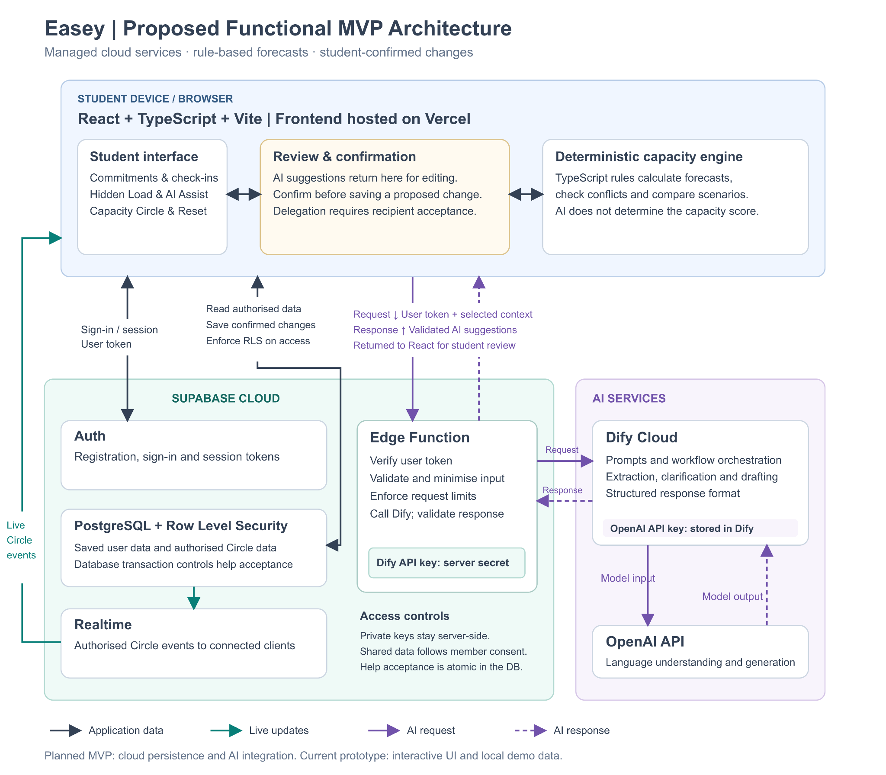

**Current versus planned:** the current public prototype is the Vercel-hosted React interface, deterministic TypeScript capacity rules, and controlled local data. The functional MVP adds Supabase persistence and permissions plus the authenticated Dify-OpenAI path shown above.

#### End-to-end system flow

1. The student accesses the Easey React application hosted on Vercel.
2. Supabase Auth verifies the student's identity.
3. React loads the student's authorised data from Supabase PostgreSQL.
4. Row Level Security limits access to the student's records and explicitly shared Circle information.
5. Deterministic TypeScript rules calculate the workload forecast.
6. When the student submits text for AI analysis, React sends it to a Supabase Edge Function.
7. The Edge Function verifies the user, validates the content, and securely calls the appropriate Dify workflow.
8. Dify manages the prompt and calls the OpenAI API.
9. The structured result returns through Dify and the Edge Function to React.
10. The student reviews and edits the result.
11. Only confirmed information is saved to Supabase.
12. Supabase Realtime sends authorised Capacity Circle changes and in-app notifications to the relevant members.
13. Responsibility transfers only after both members agree on the scope and the receiving member explicitly accepts it. A reduced-scope response remains a counterproposal until agreed, while a declined request leaves the original responsibility unchanged.

**Security boundary:** the browser never receives the Dify or OpenAI credential. The Edge Function verifies the Supabase token, validates and minimises the payload, enforces request limits, calls Dify, validates the returned structure, and sends an editable suggestion back to React. Dify stores the model credential and manages the AI workflow. No extracted task, proposed change, delegation, or message is committed without explicit confirmation.

**Collaboration boundary:** Row Level Security exposes only authorised records and member-approved signals. Realtime distributes authorised Circle events, while database transactions prevent two members from accepting the same assignment part. A reduced-scope reply remains a counterproposal; responsibility stays with the original student until both people agree and the recipient accepts.

### 5.4 Transparent Capacity Model

The prototype uses a visible heuristic rather than pretending to provide a clinically validated prediction.

```text
incoming impact = time cost + focus cost + urgency cost + context-switch cost
forecast        = current capacity + incoming impact - selected action savings

judge scenario  = 82 + (12 + 8 + 7 + 4) - (12 + 7 + 10)
                = 84%
```

Changing duration, effort, or deadline pressure updates the forecast immediately. The final score is a workload decision aid and not a medical measurement.

### 5.5 Security, Privacy, and Feasibility Controls

| Risk                       | Planned control                                                                                                                  |
| -------------------------- | -------------------------------------------------------------------------------------------------------------------------------- |
| Sensitive message content  | Analyse text only after deliberate submission; minimise fields and avoid retaining raw messages longer than necessary.           |
| Incorrect AI extraction    | Show an Evidence Map, distinguish stated facts from suggestions, allow edits, and require confirmation before saving.            |
| API-key exposure           | Keep Dify credentials in Edge Function secrets and the OpenAI credential in Dify; commit no private keys to GitHub.              |
| Unauthorised data access   | Apply deny-by-default Row Level Security and test owner, member, non-member, and removed-member cases.                           |
| Circle privacy             | Share only member-approved capacity signals; hide private task titles and check-in responses by default.                         |
| AI hallucination           | Use bounded prompts, structured output, server validation, visible evidence, and non-authoritative editable suggestions.         |
| Delegation race condition  | Use a transactional acceptance state so only one person can accept an assignment part.                                           |
| AI-service failure         | Preserve manual entry and the deterministic capacity engine when Dify or OpenAI is unavailable.                                  |
| Unvalidated capacity score | Keep the formula transparent and non-clinical; validate comprehension and weighting with students before making stronger claims. |
| Excessive usage or cost    | Authenticate requests, rate-limit by user, keep outputs short, monitor usage, and set a spending cap.                            |

### 5.6 Three-Week Build Plan

The public UI is already complete, so the build phase focuses on one functional vertical slice. **P0 is the release gate, P1 follows the working core, and P2 is limited to one collaboration slice that ships only after privacy and concurrency tests pass.** This prevents feature expansion from weakening the core journey.

#### Already completed in the interactive prototype

- Responsive React user interface.
- Commitment management.
- 60-second check-in.
- Workload Dashboard.
- Deterministic capacity calculation.
- Hidden Load interaction.
- Commitment Sandbox.
- Explainable Action Plan.
- Boundary Assistant.
- Before-and-after Decision Receipt.
- Reset Mode activities.
- Capacity Circle and Assignment Workboard interface.
- Public Vercel deployment.

These features currently use controlled demo data.

#### Prioritised implementation backlog

**P0 - Persistent functional foundation**

1. Configure Supabase Auth.
2. Create the required PostgreSQL tables.
3. Replace browser-local data with persistent user data.
4. Apply Row Level Security policies.
5. Save commitments, check-ins, decisions, and recovery preferences.
6. Preserve the complete Capture -> Sandbox -> Action Plan -> Boundary -> After State journey.

**P1 - Controlled AI workflow**

1. Create one authenticated Supabase Edge Function.
2. Build one Dify workflow for Hidden Load extraction.
3. Connect Dify to the OpenAI API.
4. Validate structured AI output.
5. Display editable extracted information.
6. Require confirmation before saving.
7. Add retry and manual-entry fallback.
8. Add editable boundary-message generation.

**P2 - Multi-user Capacity Circle**

1. Create real Circle invitations and membership records.
2. Store each member's visibility preferences.
3. Show only approved capacity signals.
4. Implement help requests and recipient acceptance.
5. Prevent multiple members from accepting the same assignment part.
6. Enable Supabase Realtime updates.
7. Record assignment, submission, review, and agreement events.

#### Three-week sequence

| Week                                            | Priority and deliverable                                                                                                                                                                                                             | Evidence of completion                                                                                                                                  |
| ----------------------------------------------- | ------------------------------------------------------------------------------------------------------------------------------------------------------------------------------------------------------------------------------------ | ------------------------------------------------------------------------------------------------------------------------------------------------------- |
| **Week 1 - P0 identity, data, and permissions** | Configure Supabase Auth; create profiles, preferences, commitments, check-ins, decisions, Circle membership, and sharing tables; replace local state; implement deny-by-default RLS.                                                 | Two test users can sign in, retain their own data across sessions, and cannot read each other's private commitments or check-ins.                       |
| **Week 2 - P0 journey + P1 controlled AI**      | Persist Capture -> Simulate -> Rebalance -> Respond -> Recover; add one authenticated Edge Function and one Dify workflow for Hidden Load extraction; connect OpenAI; validate structured output and preserve manual entry.          | A student can return to the same saved decision; invalid or unavailable AI never blocks the journey; no extracted detail is saved without confirmation. |
| **Week 3 - P2 collaboration slice + hardening** | Implement one real Circle invitation, help request, accept/decline flow, agreement record, and transactional double-acceptance protection; add editable boundary drafting, rate limits, errors, accessibility, and deployment tests. | An opted-in member sees only approved signals and can respond to one scoped request; secrets stay server-side; core tests pass on desktop and mobile.   |

Full Realtime Workboard synchronisation, advanced AI Assist conversation memory, external integrations, and additional multiplayer activities remain outside this three-week commitment.

### 5.7 MVP Acceptance Criteria

- A student can register, sign in, and access saved information across sessions.
- Commitments and check-ins persist in Supabase.
- A reviewer can complete **Capture -> Simulate -> Rebalance -> Respond -> Recover** without a dead end.
- The interface explains every capacity change and reproduces the 82% -> 113% -> 84% demonstration.
- A deliberately submitted message becomes editable structured information; stated details and AI-suggested hidden costs remain distinguishable.
- Extracted fields, proposed changes, delegation, and outgoing messages require confirmation.
- A signed-in user cannot read another user's private commitments or check-in answers.
- Capacity Circle shares only fields selected by the member and never auto-assigns work; a help request remains pending until the recipient accepts.
- A transaction prevents two members from accepting the same assignment part, and a declined request leaves the original responsibility unchanged.
- Dify output follows a strict schema; service failure falls back to manual entry rather than breaking the journey.
- Reset Mode uses saved relaxation preferences while still allowing manual choice.
- Main flows work on common desktop and mobile widths and can be completed by keyboard.
- The interface communicates warning states using text and icons as well as colour, and labels capacity as non-clinical workload decision support.

### 5.8 Validation Plan

We will test with university students using the same incoming-request scenario before and after Easey.

| Question                                                 | Planned measure                                                                                       |
| -------------------------------------------------------- | ----------------------------------------------------------------------------------------------------- |
| Do students understand why capacity changed?             | Ask users to explain the four cost factors after using the Sandbox.                                   |
| Does Easey change the decision?                          | Compare full yes / smaller yes / decline before and after the simulation.                             |
| Are the recommendations usable?                          | Record whether users can choose and justify a realistic action without facilitator help.              |
| Does Boundary Assistant reduce communication difficulty? | Short confidence rating before and after editing the message.                                         |
| Is privacy understandable?                               | Ask users to predict exactly what a teammate can see in Capacity Circle.                              |
| Is responsibility status understandable?                 | Ask users to distinguish proposed, pending, accepted, and declined help without prompting.            |
| Is Hidden Load extraction reliable enough?               | Compare extracted fields with a manually labelled set and record corrections before confirmation.     |
| Does the recovery layer help without distracting?        | Measure voluntary completion and self-reported usefulness; do not optimise for streaks or time spent. |

### 5.9 Explicitly Outside the First MVP

- Automatic reading of WhatsApp, email, or LMS messages.
- Full calendar or university LMS synchronisation.
- Native Android and iOS applications.
- Email, push, and third-party music-service integrations.
- Automatic task transfer without teammate acceptance.
- Full Realtime Workboard synchronisation and advanced analytics.
- Public capacity rankings or exposure of private check-in answers.
- Clinical stress or burnout diagnosis.
- Advanced multiplayer games, purchases, or reward leaderboards.

### 5.10 Responsible Future Work

- Validate capacity factors and weights using student testing and expert feedback.
- Add opt-in calendar or LMS integrations only after privacy review.
- Explore preference-based music recommendations without storing unnecessary listening data.
- Validate the **Stress Sprite Workshop** described in Section 4.4 using fictional preset parts or self-drawn characters. Test whether capped cosmetic rewards support task completion and short recovery without adding pressure, dependence, aggression, or opportunities to target a real person.

---

## 6. Run the Prototype Locally

### Requirements

- Node.js 20 or later
- npm
- Git

```bash
npm install
npm run dev
```

Open the local address printed in the terminal.

```bash
npm run lint
npm run build
npm run preview
```

No environment variables are required for the current local-data prototype.

### Project Structure

```text
src/
|-- components/   Reusable product components and interface primitives
|-- data/         Controlled prototype data
|-- hooks/        Shared demo state and local persistence
|-- lib/          Capacity mood and utility logic
|-- routes/       Application pages and decision stages
|-- router.tsx    Router configuration
`-- styles.css    Theme and Tailwind design tokens

docs/images/               Earlier prototype evidence retained in the project
docs/report-images/        All 16 images imported from the final submission document
```

`src/routeTree.gen.ts` is generated from the route files and should not be edited manually.

---

## 7. Submission Checklist

- [x] Public GitHub repository prepared
- [x] Public UI prototype linked and tested
- [x] Problem, stakeholders, competitors, and solution documented
- [x] Ideas kept and dropped documented
- [x] Ideation boards embedded
- [x] Mentor feedback and resulting changes documented
- [x] All 16 images from the submission document embedded
- [x] Eleven prototype screens shown with interaction captions
- [x] Novelty and competitor comparison explained
- [x] Current and planned architecture separated
- [x] Three-week build plan and acceptance criteria defined
- [ ] Add the unlisted YouTube video link
- [ ] Add the public presentation slides link
- [ ] Test every README link from an incognito window

---

## Team Win Win

- Low Yan Di
- Lim Zhun Zi
- Tee Jun Hao
- Ng Yee Qing

**Easey - Know your capacity before you say yes.**
